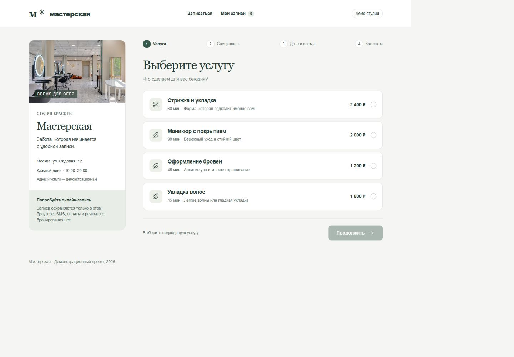
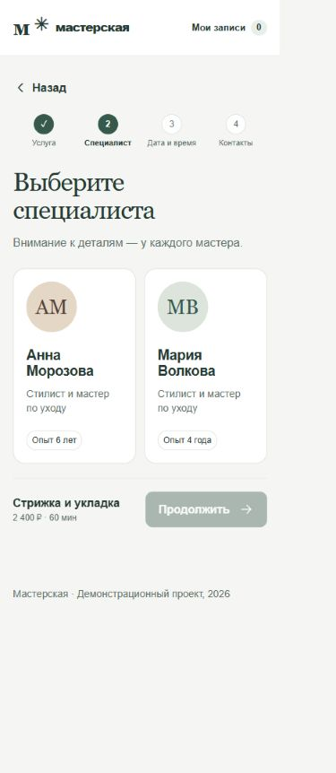
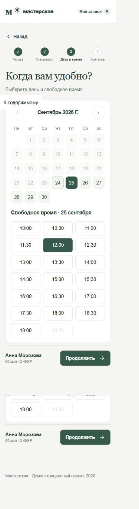
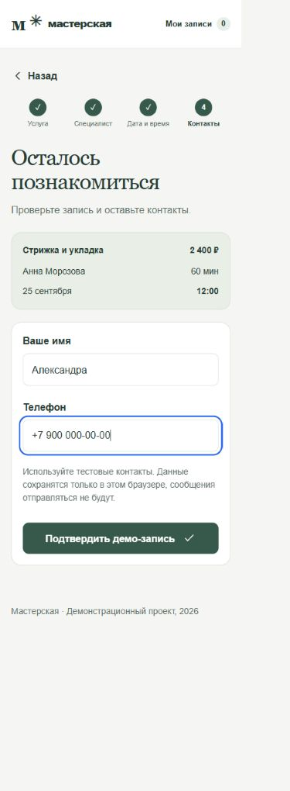
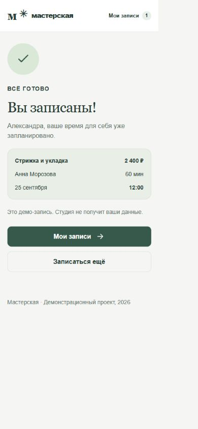
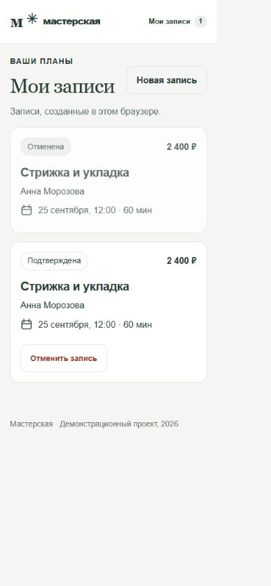

# Мастерская

Веб-приложение онлайн-записи. Время для себя — в несколько простых шагов. От выбора услуги до подтверждения записи.

[Открыть демо](https://lykovroman.github.io/masterskaya-booking/)

## Задача

Показать студии, как принимать записи без переписки: дать клиенту выбрать услугу, специалиста и удобное время самостоятельно.

## Реализовано

- Четыре услуги с ценой и длительностью
- Выбор одного из двух специалистов
- Календарь и доступные слоты с блокировкой прошлого времени
- Проверка имени и телефона с понятными ошибками
- Подтверждение и сохранение записей в localStorage
- Раздел «Мои записи», отмена и освобождение слота
- Проверка пересечения записей и завершения до закрытия студии

## Попробовать

Стрижка и укладка → Анна Морозова → будущая дата → свободное время → Александра, +7 900 000-00-00 → подтверждение → «Мои записи» → отмена.

## Запуск

Node.js 18 или новее. Зависимости не нужны.

```sh
git clone https://github.com/LykovRoman/masterskaya-booking.git
cd masterskaya-booking
npm start
```

Откройте http://127.0.0.1:4173. Для другого порта: `node server.mjs . 4174`.

Стек: HTML, CSS, JavaScript. Статические файлы публикуются через GitHub Pages.

## Границы демо

Данные хранятся только в текущем браузере. Используйте тестовые имя и телефон. Нет SMS, оплаты, серверного бронирования и синхронизации с календарями. Доступность слотов моделируется локально; между устройствами записи не синхронизируются.

## Скриншоты

### Услуги · компьютер



### Выбор специалиста



### Дата и время



### Контактная форма



### Подтверждение



### Мои записи



## Прохождение сценария

[Короткий видеотур](media/walkthrough.mp4) — последовательность реальных экранов работающего демо.


## Проверка

Проверены мобильная, планшетная и настольная ширины; основные переходы и отсутствие горизонтального переполнения. Проверены валидация, подтверждение, сохранение после перезагрузки и отмена.

Источники фотографий — [CREDITS.md](CREDITS.md).

Даты коммитов распределены по этапам демонстрационной разработки и не отражают фактическую длительность работы.
